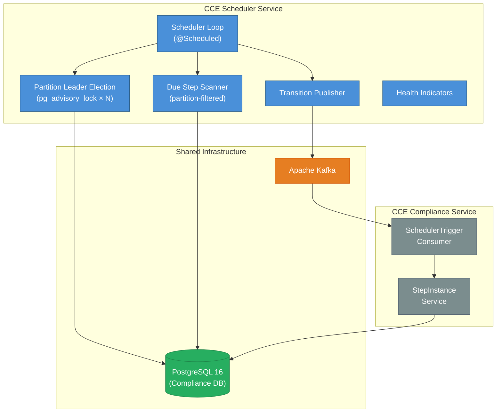

# Architecture & Design

## 1. System Context

The **CCE Scheduler Service** is a headless background service within the CCE platform. It drives time-based step state transitions by polling the Compliance Service's `step_instance` table and publishing transition requests to Kafka. It has **no REST API endpoints** — communication with the Compliance Service is exclusively via Kafka.



**This service does NOT handle:** event ingestion, protocol matching, step completion, deviation detection, analytics, authentication, or any REST API operations.

---

## 2. Technology Stack

| Concern | Technology | Version |
|---------|------------|---------|
| Language | Java | 21 (LTS) |
| Framework | Spring Boot | 3.4.x |
| Build tool | Gradle | 8.x |
| Database | PostgreSQL | 16+ (shared with Compliance Service) |
| Message broker | Apache Kafka | 3.7+ (KRaft mode) |
| DB access | Spring Data JPA + Hibernate | (Spring Boot managed) |
| DB migration | Flyway | (Spring Boot managed) |
| Connection pool | HikariCP | (Spring Boot default) |
| Observability | Micrometer + Prometheus | (Spring Boot managed) |
| Testing | JUnit 5, Testcontainers | |

### Key Gradle Dependencies

```groovy
// Spring Boot starters
implementation 'org.springframework.boot:spring-boot-starter'
implementation 'org.springframework.boot:spring-boot-starter-data-jpa'
implementation 'org.springframework.boot:spring-boot-starter-actuator'
implementation 'org.springframework.boot:spring-boot-starter-web'  // for actuator endpoints
implementation 'org.springframework.kafka:spring-kafka'

// Database
runtimeOnly 'org.postgresql:postgresql'
implementation 'org.flywaydb:flyway-core'
implementation 'org.flywaydb:flyway-database-postgresql'

// Observability
implementation 'io.micrometer:micrometer-registry-prometheus'

// Testing
testImplementation 'org.springframework.boot:spring-boot-starter-test'
testImplementation 'org.springframework.kafka:spring-kafka-test'
testImplementation 'org.testcontainers:postgresql'
testImplementation 'org.testcontainers:kafka'
testImplementation 'org.testcontainers:junit-jupiter'
```

---

## 3. Package Structure

```
src/main/java/org/openphc/cce/scheduler/
├── SchedulerServiceApplication.java          # @SpringBootApplication + @EnableScheduling
├── config/
│   ├── SchedulerProperties.java              # @ConfigurationProperties(prefix = "cce.scheduler")
│   ├── SchedulingConfig.java                 # Thread pool (2 threads)
│   ├── JpaConfig.java                        # JPA/Hibernate settings
│   ├── KafkaProducerConfig.java              # Kafka producer factory
│   └── ObservabilityConfig.java              # MeterBinder for custom metrics
├── domain/
│   ├── model/
│   │   ├── StepInstance.java                 # Read-only entity (@Immutable)
│   │   ├── SchedulerLease.java               # Singleton lease entity
│   │   └── enums/
│   │       └── StepState.java                # PENDING, DUE, OVERDUE, MISSED, COMPLETED, SKIPPED
│   └── repository/
│       ├── StepInstanceRepository.java       # Read-only queries
│       └── SchedulerLeaseRepository.java     # Lease upsert
├── engine/
│   ├── SchedulerLoop.java                    # @Scheduled main loop with leader guard
│   ├── DueStepScanner.java                   # PostgreSQL query + transition determination
│   ├── DueStep.java                          # Record: stepInstanceId, transitionType, metadata
│   └── TransitionPublisher.java              # Orchestrates Kafka publish per DueStep
├── health/
│   └── LeaderHealthIndicator.java            # Custom health indicator for leader status
├── kafka/
│   ├── SchedulerTriggerMessage.java          # Kafka message record
│   └── SchedulerTriggerProducer.java         # Kafka template wrapper
└── leader/
    └── LeaderElection.java                   # pg_advisory_lock lifecycle

src/main/resources/
├── application.yml
├── application-docker.yml
└── db/migration/
    └── V1__create_scheduler_lease.sql

src/test/java/org/openphc/cce/scheduler/      # Unit tests
src/integrationTest/java/org/openphc/cce/scheduler/  # Integration tests
```

**Total:** ~19 source files across 8 packages.

---

## 4. Component Interactions

### 4.1 Scan-Publish Cycle

The core loop runs on a `@Scheduled(fixedDelay)` cadence (default: 5 seconds). The `fixedDelay` ensures no overlap — the next cycle starts only after the previous cycle completes.

Each instance only scans the **partitions** it owns (determined by acquired advisory locks). An instance owns at most its **fair share** of partitions (see §4.2) — though it may own several when it is the only live instance. With `total-partitions=1` (default), the behavior is identical to a single-leader model scanning the full table.

```
1. Partition leader check (any pg_advisory_locks held?)
   - If no locks held → skip this cycle, return immediately
2. For each owned partition P in ownedPartitions:
   a. DueStepScanner.scan(batchSize, P, totalPartitions)
      - Query step_instance for rows where time thresholds are met
      - Filter: MOD(ABS(HASHTEXT(protocol_instance_id::text)), totalPartitions) = P
      - Determine transition type for each row
      - Return List<DueStep>
   b. TransitionPublisher.publish(dueSteps)
      - For each DueStep: build SchedulerTriggerMessage, publish to Kafka synchronously
      - Track success/failure counts
   c. Update scheduler_lease heartbeat for partition P
   d. Record metrics (scan duration, batch size, transitions by type, partition=P)
3. Wait fixedDelay → repeat
```

### 4.2 Partitioned Leader Election Lifecycle

#### Why do we need this?

Without partitioning, only **one instance** can scan the `step_instance` table at a time (single-leader). As the number of protocol instances grows, a single scanner becomes a throughput bottleneck. The Partitioned Leader Election Lifecycle allows **multiple instances to scan concurrently** by dividing the data space into non-overlapping partitions, each processed independently — achieving horizontal scale-out without duplicate processing or coordination overhead.

#### What is a partition?

A **partition** is a logical slice of the `step_instance` table determined by a hash of `protocol_instance_id`:

```
partition(row) = MOD(ABS(HASHTEXT(protocol_instance_id::text)), totalPartitions)
```

- `totalPartitions` (N) is set via configuration (`cce.scheduler.total-partitions`).
- Each partition is identified by an index **P** in the range `[0, N-1]`.
- A given `protocol_instance_id` always maps to the **same** partition, ensuring deterministic, conflict-free assignment without shared state.
- Partitions are purely logical — no physical table partitioning is involved.

#### What is the advisory lock for?

Each partition is guarded by a **PostgreSQL session-level advisory lock** (`pg_try_advisory_lock(baseKey + P)`). The lock serves as:

1. **Distributed mutex** — guarantees that exactly one instance scans a given partition at any point in time, preventing duplicate Kafka events.
2. **Failure detector** — advisory locks are automatically released when the holding database connection drops (instance crash, network failure), enabling surviving instances to take over immediately.
3. **Zero-infrastructure coordination** — no external system (ZooKeeper, etcd, Redis) is required; PostgreSQL itself provides the consensus.

The lock is held for the **lifetime of the dedicated JDBC connection** (not per-transaction), so it persists across scan cycles without re-acquisition overhead.

#### Concurrency model

The service supports **fair-share partitioned multi-leader** concurrency via multiple PostgreSQL advisory locks. Each partition is an independent scan domain — N partitions allow up to N instances to process concurrently. Every instance — including standbys that own no partitions — registers a heartbeat in the `scheduler_node` table each cycle, so the live cluster size is known to all. From it, each instance computes its **fair share** and acquires at most that many locks, releasing any surplus it grabbed while alone:

```
fairShare = ceil(totalPartitions / activeNodes)
```

This self-balances without restarts: a single instance still owns **all** partitions (so there are never orphans), and as peers join, the over-provisioned instance sheds partitions until ownership is even. With `total-partitions=1` (default), the behavior is identical to the original single-leader model.

```
Startup / each cycle (every leaderRetryInterval, default 5s):
1. Ensure dedicated JDBC connection (outside HikariCP pool)
2. Upsert this node's heartbeat into scheduler_node (even as a standby)
3. activeNodes = count of scheduler_node rows with a fresh heartbeat; prune stale rows
4. fairShare = ceil(totalPartitions / activeNodes)
5. If currently holding more than fairShare → pg_advisory_unlock the surplus
   (highest-indexed first) so newer instances can take it
6. While holding fewer than fairShare → pg_try_advisory_lock free partitions
   (non-blocking); on success, update that partition's scheduler_lease row
7. If ownedPartitions is empty → standby; else → leader (scans owned partitions)

Standby:
- Keeps heartbeating to scheduler_node so it is counted toward fairShare
- Acquires partitions as soon as a peer releases its surplus (≤ leaderRetryInterval)
- Scan loop skips processing on each cycle

Failover:
- When an instance dies, its PG connection drops and ALL its advisory locks release;
  its scheduler_node row goes stale and is pruned after leaseDurationSeconds
- Surviving instances recompute a larger fairShare and acquire the orphaned locks
  on their next retry → no partitions left unprocessed

Shutdown (@PreDestroy):
- Release held advisory locks, deregister from scheduler_node, close connection
```

**Example with 3 partitions, 3 instances (steady state, fairShare = 1):**
```
Instance A → owns [partition 0]
Instance B → owns [partition 1]
Instance C → owns [partition 2]
```

**Example with 3 partitions, 2 instances joining one at a time (self-rebalance):**
```
t0: Instance A boots alone → activeNodes=1, fairShare=3 → owns [0, 1, 2]
t1: Instance B joins → registers heartbeat, all locks still held → standby (owns [])
t2: Instance A's next cycle → activeNodes=2, fairShare=ceil(3/2)=2
    → releases partition 2 → owns [0, 1]
t3: Instance B's next cycle → acquires the freed lock → owns [2]
```

Convergence takes a few `leaderRetryInterval` cycles (≈5–10s), no restart required.

#### Why a fair-share cap?

Without it, the instance that boots first wins every lock before the others finish starting (pod-start skew is far larger than any lock-acquisition delay), leaving the rest as idle standbys — HA, but **no throughput distribution**. Bounding each instance to `ceil(totalPartitions / activeNodes)` and shedding the surplus guarantees the work actually spreads across instances while still keeping every partition owned at all times.

A small **randomized micro-delay** (`0–50ms`, `cce.scheduler.lock-acquire-delay-ms`) is still applied between consecutive lock attempts to stagger truly simultaneous starts; it is a minor smoothing aid, not the primary fairness mechanism (the fair-share cap is).

**Example with 3 partitions, 1 instance (safe — no orphans):**
```
Instance A → activeNodes=1, fairShare=3 → owns [partition 0, 1, 2] → scans all
```

### 4.3 Shared Database Access

The Scheduler connects to the **same PostgreSQL database** (`ccedb`) as all other CCE services. The database is deployed by the CCE Collector Service.

| Table | Owner | Scheduler Access | Purpose |
|---|---|---|---|
| `step_instance` | Compliance Service | **Read-only** | Query for due transitions (partition-filtered) |
| `scheduler_lease` | Scheduler Service | **Read-write** | Partition leader heartbeats (one row per partition) |
| `scheduler_node` | Scheduler Service | **Read-write** | Live-instance registry (one row per instance) used to compute fair share |
| All other tables | Compliance Service | **No access** | Not used by Scheduler |

**Important:** The Scheduler uses `@Immutable` on its `StepInstance` entity to prevent accidental writes. The actual state transitions are performed by the Compliance Service after consuming `SchedulerTriggerMessage` from Kafka.

---

## 5. Threading Model

| Thread Pool | Size | Purpose |
|---|---|---|
| `scheduler-pool` | 2 | @Scheduled task execution (scan loop + heartbeat) |
| HikariCP | 5 | JDBC connections for partition-filtered step_instance queries and lease updates |
| Kafka producer I/O | 1 | Kafka message publishing (synchronous) |
| Advisory lock | 1 | Dedicated JDBC connection for `pg_advisory_lock` (not from HikariCP) — holds all acquired partition locks |

---

## 6. Error Handling

| Error Source | Handling | Impact |
|---|---|---|
| PostgreSQL unreachable | Log error, skip this cycle, retry on next interval | Service remains running; catches up when DB recovers |
| Kafka broker unreachable | Log error per message, continue to next step in batch | Some transitions delayed; Kafka retries handle transient failures |
| Advisory lock lost | Detect on next heartbeat, release remaining locks, enter standby | Surviving instances acquire all orphaned partitions |
| Stale step (already transitioned) | Compliance Service ignores duplicate `SchedulerTriggerMessage` | No impact — idempotent consumer |
| Exception in scan loop | Catch-all in `@Scheduled` method — never terminates the scheduled task | Logged, metrics incremented, next cycle proceeds normally |

---

## 7. Observability

### 7.1 Metrics (Micrometer)

| Metric | Type | Tags | Description |
|---|---|---|---|
| `cce.scheduler.scan.duration` | Timer | `partition` | Time spent per scan cycle |
| `cce.scheduler.scan.steps` | Counter | `transition_type`, `partition` | Steps found per transition type |
| `cce.scheduler.publish.success` | Counter | `transition_type`, `partition` | Successful Kafka publishes |
| `cce.scheduler.publish.failure` | Counter | `transition_type`, `partition` | Failed Kafka publishes |
| `cce.scheduler.leader.status` | Gauge | `partition` | 1 = partition leader, 0 = standby |
| `cce.scheduler.cycle.count` | Counter | `partition` | Total scan cycles executed |

### 7.2 Health Indicators

| Indicator | Details |
|---|---|
| `leaderElection` | UP if leader election is functioning (regardless of leader/standby status). Reports `leader: true/false`, `ownedPartitions: [0,1]`, `totalPartitions`, `lastHeartbeat`. |
| `db` (auto) | PostgreSQL connectivity |
| `kafka` (auto) | Kafka broker connectivity |

### 7.3 Structured Logging

```
correlationId: sched-DUE_TO_OVERDUE-770e8400
stepInstanceId: 770e8400-e29b-41d4-a716-446655440002
transitionType: DUE_TO_OVERDUE
leaderStatus: true
ownedPartitions: [0,1]
currentPartition: 0
totalPartitions: 3
```

---

## 8. Scaling & Deployment

### 8.1 Fair-Share Partitioned Multi-Leader Model

The Scheduler supports **fair-share partitioned multi-leader** concurrency for horizontal scaling. Each instance bounds itself to `ceil(totalPartitions / activeNodes)` partitions and releases any surplus, so partitions spread evenly across the live instances instead of one instance hogging them all.

- **Default:** `total-partitions=1` — single-leader mode, identical to a traditional active-standby deployment.
- **Scaled:** `total-partitions=N` with any number of replicas — partitions are distributed by fair share across live instances. Each instance scans all partitions it owns sequentially per cycle.
- **No orphaned partitions:** Even with 1 instance and `total-partitions=3`, fair share is 3 and that instance owns all 3 partitions. No data is ever missed.
- **No StatefulSet required** — uses a regular Kubernetes Deployment. Partition assignment is dynamic via advisory locks and the `scheduler_node` registry.
- **Failover:** When an instance dies, ALL its locks are released and its registry row is pruned. Surviving instances recompute a larger fair share and acquire the orphaned locks on their next retry (≤ `leaderRetryInterval`, default 5s).
- **Self-rebalancing (no restart):** When an instance joins, over-provisioned instances shed their surplus partitions within a few retry cycles — rolling restarts are **not** required to rebalance.
- **Stateless between runs** — all state is in PostgreSQL. An instance can be replaced at any time.

### 8.2 Deployment Examples

| Scenario | `total-partitions` | `replicas` | Behavior |
|---|---|---|---|
| Single instance | `1` | `1` | One leader, no failover |
| HA (no parallelism) | `1` | `2` | Active-standby, automatic failover |
| Parallel (3-way) | `3` | `3` | 3 concurrent leaders, fair share 1 each — scans 1/3 of steps per instance |
| Parallel + HA | `3` | `5` | 3 leaders (each owns 1 partition) + 2 standby spares |
| Under-provisioned (safe) | `3` | `1` | 1 instance owns all 3 partitions, scans full table sequentially |
| Under-provisioned (partial) | `3` | `2` | Fair share `ceil(3/2)=2` — split 2:1 across instances, no orphans |
